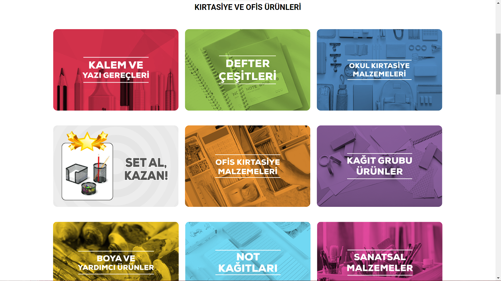
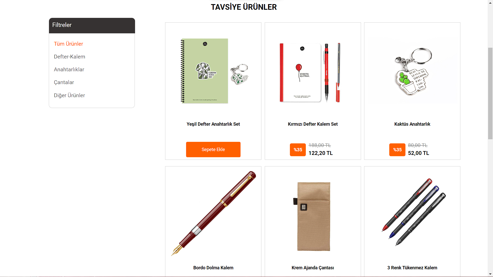
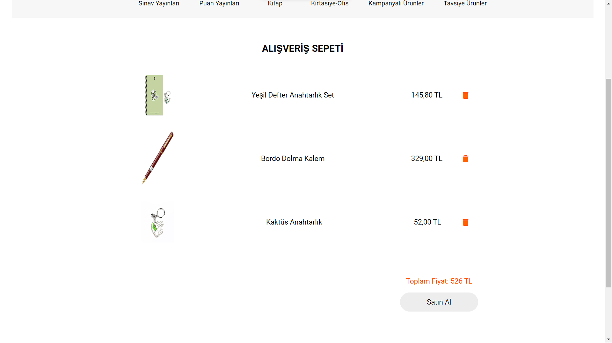
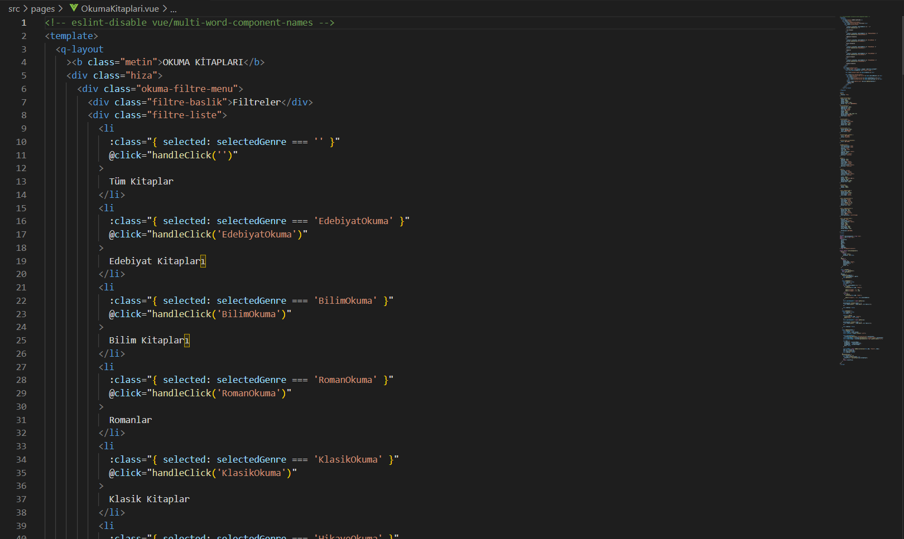

# Dynamic E-commerce Website with Vue.js, Quasar, Firebase, and Firestore

# Note
  This project is clone of enaktif.com.

# Description/Summary
  This project is a dynamic e-commerce website that leverages the power of modern web technologies to provide a seamless shopping experience. Built using HTML, CSS, JavaScript, Vue.js, Quasar, Firebase, and Firestore, the website offers real-time updates and ensures a persistent shopping cart for users.
  
**By combining the power of Vue.js, Quasar, Firebase, and Firestore, this project provides a robust and efficient solution for building dynamic e-commerce websites. It showcases the potential of these technologies in delivering a seamless shopping experience with real-time updates and a persistent shopping cart.**

# Features
 ## Real-time Data Updates:
  The website pulls product information directly from Firestore, ensuring that the latest product details are displayed to users. Changes made in the Firestore database are instantly reflected on the website, providing a real-time experience.

## Interactive User Interface
  Vue.js and Quasar framework are utilized to create an engaging and responsive user interface. Users can seamlessly navigate through the website, browse products, and add items to their shopping cart without page refreshes.

## Persistent Shopping Cart
  The shopping cart functionality is implemented using Firebase's Firestore, allowing users to add products to their cart and have their selections saved in a separate database. This ensures that the cart contents are retained even if the user navigates away from the page or refreshes it.

## Scalable and Secure Backend
  Firebase and Firestore provide a robust and scalable backend infrastructure for storing and retrieving data. With Firestore's security rules, user authentication, and authorization can be easily implemented, ensuring a secure and personalized experience.

## Flexible and Extensible
  The project is structured using a component-based architecture, making it easy to add new features or modify existing ones. The modular design allows for easy maintenance and scalability, making it suitable for both small and large-scale e-commerce applications.

## Open Source
  This project is open-source and available on GitHub, allowing developers to explore the codebase, contribute enhancements, and learn from its implementation. It serves as a valuable resource for those interested in building dynamic e-commerce websites using Vue.js, Quasar, Firebase, and Firestore.

# Some Pictures of the Project and the Code

  

 

 

 

 

 

 

